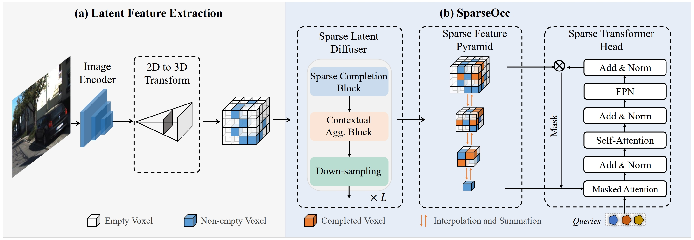
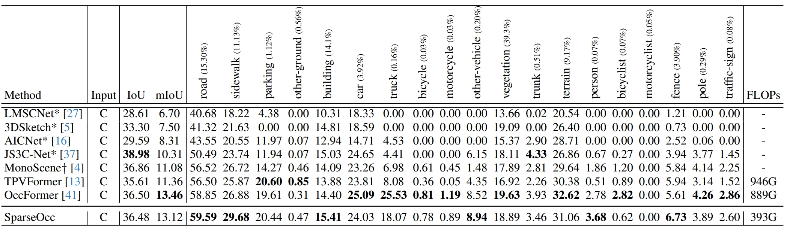

# SparseOcc: Rethinking Sparse Latent Representation for Vision-Based Semantic Occupancy Prediction (CVPR 2024)

## News
- **[2024/07/01]** Our paper [OccGen](https://arxiv.org/abs/2404.15014) and [VEON](https://arxiv.org/abs/2407.12294) for multi-modal and open-vocabulary occpancy prediction are accepted by ECCV 2024.
- **[2024/04/15]** SparseOcc is on [Arxiv](https://arxiv.org/abs/2404.09502).
- **[2023/03/08]** SparseOcc is accepted by CVPR 2024.


## Abstract
Vision-based perception for autonomous driving requires an explicit modeling of a 3D space, where 2D latent representations are mapped and subsequent 3D operators are applied. However, operating on dense latent spaces introduces a cubic time and space complexity, which limits scalability in terms of perception range or spatial resolution. Existing approaches compress the dense representation using projections like Bird's Eye View (BEV) or Tri-Perspective View (TPV). Although efficient, these projections result in information loss, especially for tasks like semantic occupancy prediction. To address this, we propose SparseOcc, an efficient occupancy network inspired by sparse point cloud processing. It utilizes a lossless sparse latent representation with three key innovations. Firstly, a 3D sparse diffuser performs latent completion using spatially decomposed 3D sparse convolutional kernels. Secondly, a feature pyramid and sparse interpolation enhance scales with information from others. Finally, the transformer head is redesigned as a sparse variant. SparseOcc achieves a remarkable 74.9% reduction on FLOPs over the dense baseline. Interestingly, it also improves accuracy, from 12.8% to 14.1% mIOU, which in part can be attributed to the sparse representation's ability to avoid hallucinations on empty voxels.



## Demo


## Benchmark Results
Occupancy Prediction on OpenOccupancy validation set:

Semantic Scene Completion on SemanticKITTI test set:


## Getting Started

- [installation](docs/install.md)

- [data_preparation](docs/prepare_dataset.md)

- [train_and_eval](docs/train_and_eval.md)


## Acknowledgement

This project is developed based on the following open-sourced projects: [BEVDet](https://github.com/HuangJunJie2017/BEVDet), [BEVFormer](https://github.com/fundamentalvision/BEVFormer), [Mask2Former](https://github.com/facebookresearch/Mask2Former), [OccFormer](https://github.com/zhangyp15/OccFormer), [OpenOccupancy](https://github.com/JeffWang987/OpenOccupancy). Thanks for their excellent work.

## Citation

If you find this project helpful, please consider giving this repo a star or citing the following paper:
```
@inproceedings{tang2024sparseocc,
  title={SparseOcc: Rethinking sparse latent representation for vision-based semantic occupancy prediction},
  author={Tang, Pin and Wang, Zhongdao and Wang, Guoqing and Zheng, Jilai and Ren, Xiangxuan and Feng, Bailan and Ma, Chao},
  booktitle={Proceedings of the IEEE/CVF Conference on Computer Vision and Pattern Recognition},
  pages={15035--15044},
  year={2024}
},

@article{wang2024occgen,
  title={OccGen: Generative multi-modal 3d occupancy prediction for autonomous driving},
  author={Wang, Guoqing and Wang, Zhongdao and Tang, Pin and Zheng, Jilai and Ren, Xiangxuan and Feng, Bailan and Ma, Chao},
  journal={arXiv preprint arXiv:2404.15014},
  year={2024}
},

@article{zheng2024veon,
  title={VEON: Vocabulary-Enhanced Occupancy Prediction},
  author={Zheng, Jilai and Tang, Pin and Wang, Zhongdao and Wang, Guoqing and Ren, Xiangxuan and Feng, Bailan and Ma, Chao},
  journal={arXiv preprint arXiv:2407.12294},
  year={2024}
}
```
